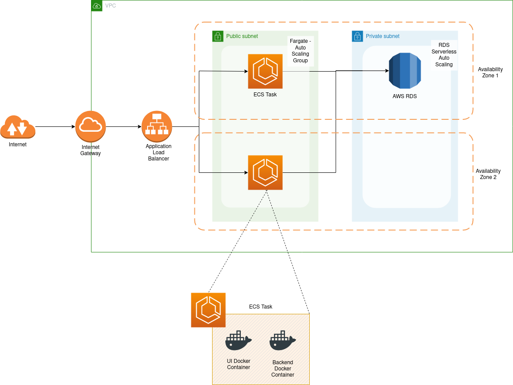

# Booking System CloudFormation Stack Template

- `network.yaml` - creates VPC with 2 public and private subnets each in 2 availability zones, an application load balancer and internet gateway
- `service-fe.yaml` - deploys front end image on Fargate task, which autoscales on demand
- `service-be.yaml` - deploys back end image on Fargate task, which autoscales on demand
- `database.yml` - creates a serverless RDS MySQL instance spanning across the 2 private subnets

Order of Deployment
1. `network.yml` - to create vpc to accommodate the aws components
2. `database.yml` - generate the necessary credentials and for backend and db connection
3. `service-be.yml` - to generate elb endpoint for frontend to connect to
4. `service.fe.yml`